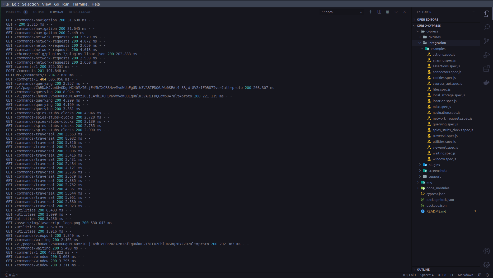

# Projeto Estudos e Práticas de Testes com Cypress

**Configurão e Instalação:** [installing Cypress](https://docs.cypress.io/guides/getting-started/installing-cypress.html)

Para executar o projeto a primeira vez e verificar se o ambiente de testes (projeto) está configurado, devemos executar o comando ``npm run cypress:open``.

Será aberta a janela de uma aplicação e será criado alguns testes de exemplos, dentro da pasta ``integration/examples``.

---

**Conteúdo Básico:**

1. JavaScript
- [Arrow Functions](https://developer.mozilla.org/pt-BR/docs/Web/JavaScript/Reference/Functions/Arrow_functions)
- [Promisses](https://developer.mozilla.org/pt-BR/docs/Web/JavaScript/Guide/Using_promises)

2. Mocha (https://mochajs.org/)
- Describe/It
- Assertivas

**Executando Projeto:**

Interface Gráfica: ``npm run cypress:open``

Linha de comando: ``npm run cypress:run``